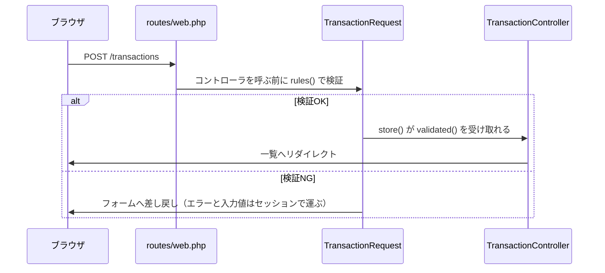

# Laravel 2 — 家計簿を Laravel の流儀に乗せる

## 前回のおさらいと、今回のゴール

前回は、手作りの家計簿を Laravel で作り直し、収支の登録と一覧まで動かしました。今日はその続きです。

ゴールは次の2つです。

1. **編集と削除**を取り込んで、家計簿の操作を一通りそろえる
2. 動いている家計簿を、**Laravel が用意している仕組みに乗せ替える**。保存したら結果を伝える、検証ルールの置き場を作る、エラーメッセージを日本語にする、日付や表示の変換をモデルに持たせる

新しい画面は増えません。いまの家計簿の「足りないところ」「気になるところ」を、Laravel の機能で1つずつ解決していく回です。

## 今日学ぶこと

| 言葉                     | ざっくり言うと                                                       | 登場する場面 |
| ------------------------ | -------------------------------------------------------------------- | ------------ |
| **フラッシュメッセージ** | 操作の結果を、次の画面に1回だけ表示する仕組み                        | ②            |
| **FormRequest**          | 検証ルールの置き場になる、自作のリクエストクラス                     | ③            |
| **言語設定**             | エラーメッセージなどの文言を、翻訳ファイルで差し替える仕組み         | ④            |
| **$casts**               | データベースから届いた値を、PHP 側でどの型として持つかの設定         | ⑤            |
| **アクセサ**             | モデルに「表示用の属性」を生やす仕組み                               | ⑥            |
| **Eager Loading**        | リレーション先をまとめて先読みする仕組み。ずっと書いてきた `with()` の正体 | ⑦            |

## 事前準備

- **Docker Desktop** が動くこと。
- **前回作った kakeibo プロジェクト**をそのまま使います。新しく作るものはありません。
- **ほかの Laravel プロジェクトの Sail が動いている場合は、止めておいてください。** 同じポートを使うため、動いたままだと家計簿が起動できません。そのプロジェクトのフォルダで次を実行します。

```sh
./vendor/bin/sail down
```

- kakeibo を起動しておきます。

```sh
cd kakeibo
./vendor/bin/sail up -d
```

- **一覧に取引が2〜3件ある状態**で始めます。空の場合は「取引を追加」から何件か入れておいてください。

??? note "前回のプロジェクトが手元に無い場合（クリックで開く）"

    ①を欠席した場合や、プロジェクトが動かなくなった場合は、①完了時点のプロジェクトを取得して、そこから始められます。

    ```sh
    git clone https://github.com/abekdwight/gslabo-lesson4.git
    cd gslabo-lesson4/kakeibo
    docker run --rm -v "$(pwd)":/opt -w /opt laravelsail/php84-composer:latest composer install
    cp .env.example .env
    ./vendor/bin/sail up -d
    ./vendor/bin/sail artisan key:generate
    ./vendor/bin/sail artisan migrate --seed
    ```

    最後の `--seed` で、①で登録したのと同じカテゴリ10件と取引3件が入ります。初回は Docker イメージの取得と `composer install` に数分かかります。以降は、このフォルダを自分のプロジェクトとして使ってください。

!!! success "確認"

    ブラウザで `http://localhost/transactions` を開いて、前回作った一覧が表示されれば準備完了です。

!!! warning "つまずきポイント：起動できない"

    - `port is already allocated` / `Address already in use`：ほかのプロジェクトの Sail が動いたままです。そのプロジェクトのフォルダで `./vendor/bin/sail down` してから、もう一度 `sail up -d` を実行してください。
    - 一覧がエラーになる：前回の最後に tinker からデータを消した場合など、取引が1件も無いだけならエラーにはなりません。エラー画面が出たときは、一番上の1文を読んでファイル名と行数を確認してください。

## 進め方

7つのステップで進めます。

1. 前回の続きを取り込む（編集と削除）
2. フラッシュメッセージ：操作の結果を伝える
3. バリデーションを FormRequest に移す
4. エラーメッセージを日本語にする
5. 日付をオブジェクトとして扱う（$casts）
6. 表示の変換をモデルに移す（アクセサ）
7. ずっと書いてきた `with('category')` の正体

①が仕上げ、②〜④がフォームまわり、⑤〜⑦がモデルまわりです。

## ① 前回の続きを取り込む（編集と削除）

編集と削除は、前回作った登録・一覧と同じ道具（ルート・コントローラ・ビュー・バリデーション）の組み合わせでできています。新しく出てくる仕組みは、ルートモデルバインディングと `@method()` の2つだけです。コードを貼って動かしながら、その2つだけ説明します。

ルートは前回 `Route::resource('transactions', ...)->except(['show'])` と宣言した時点で6本そろっているので、追記はありません。`route:list` で見た URL `transactions/{transaction}` の `{transaction}` には取引の ID が入り、コントローラは引数 `Transaction $transaction` で該当の1件を受け取ります。これが1つ目の新しい仕組み、**ルートモデルバインディング**です。URL に入った ID から、Laravel が該当の1件を取得して引数に渡してくれます。[ルートモデルバインディング](https://readouble.com/laravel/13.x/ja/routing.html#route-model-binding)

まず、一覧に操作の列を足します。`resources/views/transactions/index.blade.php` を次の内容に差し替えます。変わるのは、見出し行の空の `<th></th>` と、各行の最後の `<td>` です。

```blade
<x-layout>
    <table>
        <thead>
            <tr>
                <th>日付</th>
                <th>カテゴリ</th>
                <th>区分</th>
                <th class="amount">金額</th>
                <th>メモ</th>
                <th></th>
            </tr>
        </thead>
        <tbody>
            @foreach ($transactions as $transaction)
                <tr>
                    <td>{{ $transaction->occurred_at }}</td>
                    <td>{{ $transaction->category->name }}</td>
                    <td>{{ $transaction->type === 'income' ? '収入' : '支出' }}</td>
                    <td class="amount">¥{{ number_format($transaction->amount) }}</td>
                    <td>{{ $transaction->note }}</td>
                    <td>
                        <a href="{{ route('transactions.edit', $transaction) }}">編集</a>
                        <form method="POST" action="{{ route('transactions.destroy', $transaction) }}">
                            @csrf
                            @method('DELETE')
                            <button type="submit" onclick="return confirm('本当に削除しますか？')">削除</button>
                        </form>
                    </td>
                </tr>
            @endforeach
        </tbody>
    </table>
</x-layout>
```

`@method('DELETE')` が2つ目の新しい仕組みです。HTML のフォームは GET と POST しか送れないので、本当に使いたいメソッドを隠しフィールドで伝えます。ルートの `DELETE transactions/{transaction}` は、POST フォームとこの1行の組で呼び出します。

次に、編集画面です。`resources/views/transactions/edit.blade.php` を新規作成します。

```blade
<x-layout>
    <h2>取引を編集</h2>

    <form method="POST" action="{{ route('transactions.update', $transaction) }}">
        @csrf
        @method('PUT')

        <p>
            <label>日付
                <input type="date" name="occurred_at" value="{{ old('occurred_at', $transaction->occurred_at) }}">
            </label>
            @error('occurred_at') <span class="error">{{ $message }}</span> @enderror
        </p>

        <p>
            <label>区分
                <select name="type">
                    <option value="expense" @selected(old('type', $transaction->type) === 'expense')>支出</option>
                    <option value="income" @selected(old('type', $transaction->type) === 'income')>収入</option>
                </select>
            </label>
            @error('type') <span class="error">{{ $message }}</span> @enderror
        </p>

        <p>
            <label>カテゴリ
                <select name="category_id">
                    @foreach ($categories as $category)
                        <option value="{{ $category->id }}" @selected(old('category_id', $transaction->category_id) == $category->id)>
                            {{ $category->name }}
                        </option>
                    @endforeach
                </select>
            </label>
            @error('category_id') <span class="error">{{ $message }}</span> @enderror
        </p>

        <p>
            <label>金額（円）
                <input type="number" name="amount" value="{{ old('amount', $transaction->amount) }}">
            </label>
            @error('amount') <span class="error">{{ $message }}</span> @enderror
        </p>

        <p>
            <label>メモ（任意）
                <input type="text" name="note" value="{{ old('note', $transaction->note) }}">
            </label>
            @error('note') <span class="error">{{ $message }}</span> @enderror
        </p>

        <p><button type="submit">更新する</button></p>
    </form>
</x-layout>
```

追加フォームとの違いは3つだけです。

- `action` が `transactions.update` になり、`@method('PUT')` が入っている
- 各 `old()` の第2引数に現在値が入っていて、開いた時点で入力済みになっている
- ボタンの文言が「更新する」

フォームがほぼ同じ内容の重複になっていますが、このままにします。

最後に、コントローラです。`app/Http/Controllers/TransactionController.php` の空いている3メソッドに中身を書きます。

```php
public function edit(Transaction $transaction)
{
    return view('transactions.edit', [
        'transaction' => $transaction,
        'categories' => Category::all(),
    ]);
}

public function update(Request $request, Transaction $transaction)
{
    $validated = $request->validate([
        'occurred_at' => 'required|date',
        'type' => 'required|in:income,expense',
        'category_id' => 'required|exists:categories,id',
        'amount' => 'required|integer|min:1',
        'note' => 'nullable|string|max:255',
    ]);

    $transaction->update($validated);

    return redirect('/transactions');
}

public function destroy(Transaction $transaction)
{
    $transaction->delete();

    return redirect('/transactions');
}
```

ここで `update` をよく見てください。`store` に書いたのと**同じ5行のルールが、もう1回**書いてあります。同じものが2箇所にある、気になる状態です。③で解決します。

!!! success "確認"

    一覧の編集リンクから金額を変えて「更新する」を押すと、一覧に反映されます。削除ボタンを押すと、確認ダイアログのあと、表から消えます。

!!! warning "つまずきポイント：編集・削除が動かない"

    - `Undefined variable $categories`：`edit` メソッドでビューに `categories` を渡し忘れています。
    - 操作列の表示が縦に崩れる：スタイルを付けている場合は、前回の `public/style.css` に操作列用のルール（`td form { display: inline; }` など）が含まれているか確認してください。
    - **419 Page Expired**：フォームの `@csrf` の書き忘れです。

## ② フラッシュメッセージ：操作の結果を伝える

いまの家計簿は、登録しても更新しても削除しても、黙って一覧に戻るだけです。操作した本人に「保存できました」が伝わりません。Laravel には、**リダイレクトした次の画面に、1回だけメッセージを出す**仕組みが用意されています。

コントローラの3箇所の `return` を変えます。

```php
// store の末尾
return redirect('/transactions')->with('message', '登録しました');

// update の末尾
return redirect('/transactions')->with('message', '更新しました');

// destroy の末尾
return redirect('/transactions')->with('message', '削除しました');
```

`with('message', ...)` は、**セッション**に値を残します。セッションは、リクエストをまたいで値を覚えておくための保管場所です。ここで残しているのは「次のリクエストまでだけ生きて、表示されたら消える」値で、この使い方を**フラッシュデータ**と呼びます。[フラッシュデータ](https://readouble.com/laravel/13.x/ja/session.html#flash-data)

受け取る側は、共通レイアウトに置きます。どの画面に戻ってもメッセージを出せるようにするためです。`resources/views/components/layout.blade.php` の `</nav>` の次の行、`{{ $slot }}` の前に追加します。

```blade
@if (session('message'))
    <p class="message">{{ session('message') }}</p>
@endif
```

`session('message')` は、セッションから値を読むヘルパ関数です。値が無ければ何も表示しません。

スタイルを付けている場合は、`public/style.css` に1ブロック足します。

```css
.message {
  background: #e8f5e9;
  border: 1px solid #a5d6a7;
  padding: 8px 12px;
  border-radius: 4px;
}
```

!!! success "確認"

    1件登録すると、一覧の上に「登録しました」と表示されます。**そのままリロードすると、メッセージだけが消えます。**「次の1回だけ」を確認できたら成功です。更新と削除でも文言が変わって表示されます。

!!! info "ポイント：実はもう使っていた"

    バリデーションで弾かれたとき、フォームに赤いエラーが出て、入力値が復元されていました。あれも同じ仕組みです。Laravel がエラーメッセージと入力値をセッションに残してフォームへ差し戻し、`@error` と `old()` がそれを読んでいます。自分で出すフラッシュメッセージは、Laravel が裏でやっていたことを表から使っているだけです。

## ③ バリデーションを FormRequest に移す

①の最後に確認した「同じ5行のルールが `store` と `update` の2箇所にある」問題を解決します。このままでは、ルールを1つ変えるたびに2箇所を同じに保ち続けることになります。検証ルールの**置き場**を1つ作り、両方からそれを使う形にします。

置き場も artisan で生成します。

```sh
./vendor/bin/sail artisan make:request TransactionRequest
```

`app/Http/Requests/TransactionRequest.php` が生成されます。開くとメソッドが2つあり、**`authorize()` が `return false;` になっている**ことにまず注意してください。authorize は「このリクエストを送ることを許可するか」の判定場所で、false のままだと全部のリクエストが 403 で拒否されます。今日の家計簿は1人用なので true にします。`rules()` には、コントローラに書いていたルールをそのまま移します。生成時に付いている説明コメントは消して構いません。書き換えた全文です。

```php
<?php

namespace App\Http\Requests;

use Illuminate\Foundation\Http\FormRequest;

class TransactionRequest extends FormRequest
{
    public function authorize(): bool
    {
        return true;
    }

    public function rules(): array
    {
        return [
            'occurred_at' => 'required|date',
            'type' => 'required|in:income,expense',
            'category_id' => 'required|exists:categories,id',
            'amount' => 'required|integer|min:1',
            'note' => 'nullable|string|max:255',
        ];
    }
}
```

コントローラ側は、**引数の型を差し替えるだけ**です。ファイル先頭の `use` に1行足します。

```php
use App\Http\Requests\TransactionRequest;
```

`store` と `update` を次のようにします。`$request->validate([...])` の行が消えて、短くなります。

```php
public function store(TransactionRequest $request)
{
    $validated = $request->validated();

    Transaction::create($validated);

    return redirect('/transactions')->with('message', '登録しました');
}

public function update(TransactionRequest $request, Transaction $transaction)
{
    $validated = $request->validated();

    $transaction->update($validated);

    return redirect('/transactions')->with('message', '更新しました');
}
```

前回から `store(Request $request)` と書いてきました。その `Request` の場所に自作の `TransactionRequest` を置くと、Laravel は**コントローラのメソッドが始まる前に** `rules()` の検証を実行します。メソッドに到達した時点で検証は済んでいて、通った値だけを `validated()` で受け取ります。検証に失敗したときの動き（エラーと入力値を持ってフォームへ差し戻す）は、いままでと同じです。[フォームリクエスト](https://readouble.com/laravel/13.x/ja/validation.html#form-request-validation)



なお、コントローラ先頭の `use Illuminate\Http\Request;` はもうどのメソッドも使っていないので、消して構いません。

!!! success "確認"

    **見た目が何も変わらないことが成功です。** 金額を空にして送信すると今までどおり弾かれ、正しく入力すれば「登録しました」まで動きます。違いはコードの側にあります。ルールを直す場所が、TransactionRequest の1箇所になりました。

!!! warning "つまずきポイント：FormRequest まわりのエラー"

    - **403 Forbidden**：`authorize()` が `return false;` のままです。
    - `Class "App\Http\Controllers\TransactionRequest" does not exist`：`use App\Http\Requests\TransactionRequest;` の書き忘れです。
    - 保存できなくなった：`rules()` へ移すときのルールの綴りを確認してください。`$request->validated()` は `rules()` に書いた項目しか返しません。ルールを自分で足していた場合は、そのルールも `rules()` へ一緒に移します。

## ④ エラーメッセージを日本語にする

金額を空で送ると「The amount field is required.」と英語で出ます。この文言、自分ではどこにも書いていません。Laravel 本体が持っている**翻訳ファイル**から来ています。まず実物を見ます。

```sh
./vendor/bin/sail artisan lang:publish
```

プロジェクト直下に `lang/` フォルダが現れ、`lang/en/validation.php` に全ルールぶんの英文が入っています。開くと、こんな行が見つかります。

```php
'required' => 'The :attribute field is required.',
```

`:attribute` の部分に項目名が差し込まれる、穴埋めの形です。ということは、**同じ形の日本語ファイルを `ja` として置けば、文言を丸ごと差し替えられます**。`lang/ja/validation.php` を新規作成します。全ルールを訳す必要はありません。今日のフォームで使っているルールのぶんだけ書きます。

```php
<?php

return [
    'required' => ':attributeは必ず入力してください。',
    'date' => ':attributeは正しい日付の形式で入力してください。',
    'in' => '選択された:attributeは正しくありません。',
    'exists' => '選択された:attributeは正しくありません。',
    'integer' => ':attributeは整数で入力してください。',
    'string' => ':attributeは文字列で入力してください。',
    'min' => [
        'numeric' => ':attributeには:min以上の数を指定してください。',
    ],
    'max' => [
        'string' => ':attributeは:max文字以内で入力してください。',
    ],

    'attributes' => [
        'occurred_at' => '日付',
        'type' => '区分',
        'category_id' => 'カテゴリ',
        'amount' => '金額',
        'note' => 'メモ',
    ],
];
```

末尾の `attributes` は項目名の対訳表です。これが無いと「amountは必ず入力してください。」のように、列名がそのまま差し込まれます。

あとは、アプリの言語を `ja` に切り替えます。設定ファイル `config/app.php` を開いて、この行を探してください。

```php
'locale' => env('APP_LOCALE', 'en'),
```

値そのものではなく、`env('APP_LOCALE', 'en')`＝「`.env` の `APP_LOCALE` を読む。無ければ `'en'`」と書いてあります。Laravel の設定はこの2段構えです。**コードが読むのは config。環境ごとに変えたい値は `.env` に置く。** というわけで、書き換えるのは `config/app.php` ではなく `.env` です。`.env` の上の方にある `APP_LOCALE=en` の行を、次のように書き換えます。

```
APP_LOCALE=ja
```

[ローカリゼーション](https://readouble.com/laravel/13.x/ja/localization.html)

!!! success "確認"

    金額を空にして送信すると、「金額は必ず入力してください。」と表示されます。attributes の対訳（amount → 金額）まで効いていることを確認してください。

!!! note "補足：訳が無いルールはどうなるか"

    `config/app.php` の `locale` の近くに `fallback_locale`（en）があります。「訳が見つからないときの逃げ先」です。`ja` に書いていないルールのメッセージは英語のまま表示されるだけで、壊れはしません。必要になったら訳を足します（「授業のあとに試すこと」の2番）。

!!! warning "つまずきポイント：英語のまま変わらない"

    - フォルダ名が `lang/jp` になっていないか確認してください。日本語のロケールは `ja` です。
    - ファイルの置き場所が `lang/ja/validation.php` になっているか確認してください。
    - `.env` に `APP_LOCALE=en` の行が残っていないか確認してください。同じキーが2行あると、あとで必ず紛らわしくなります。
    - それでも直らないときは、`./vendor/bin/sail artisan config:clear` を実行してからリロードしてください。

## ⑤ 日付をオブジェクトとして扱う（$casts）

ここからはモデルまわりです。一覧の日付は `2026-08-01` と表示されています。これを「8月1日」の形式にすることを考えます。まず、いまの `occurred_at` に何が入っているかを tinker で確認します。

```sh
./vendor/bin/sail artisan tinker
```

```php
Transaction::first()->occurred_at;
```

```php
= "2026-08-01"
```

文字列です。前回マイグレーションで `$table->date('occurred_at')` と型を指定しましたが、あれは**データベース側の型**です。DATE 型として保存され、SQL の中では日付として比較・整列されますが、PHP がその値を受け取るときは文字列になります。届いた値を **PHP 側でどの型として持つか**は別の設定で、それが `$casts` です。`app/Models/Transaction.php` に追加します。

```php
    protected $casts = [
        'occurred_at' => 'immutable_date',
    ];
```

`'date'` と書くと Carbon という日付クラスに、`'immutable_date'` と書くとその不変版である CarbonImmutable になります。Carbon は `addDay()` などのメソッドが**自分自身を書き換える**ため、同じ変数を2回使うと日付がずれる事故が起きやすく、不変版を選んでおくと安全です。[属性のキャスト](https://readouble.com/laravel/13.x/ja/eloquent-mutators.html#attribute-casting)

!!! success "確認"

    tinker を `exit` して入り直し、もう一度同じ属性を見ます。

    ```php
    Transaction::first()->occurred_at;
    ```

    ```php
    = Carbon\CarbonImmutable @… {
        date: 2026-08-01 00:00:00.0 UTC (+00:00),
      }
    ```

    文字列だったものが、日付オブジェクトになりました。

この時点でブラウザをリロードすると、一覧の日付が `2026-08-01 00:00:00` のように長くなっています。オブジェクトをそのまま表示しているためです。日付オブジェクトには `format()` が使えるので、一覧（`index.blade.php`）の日付のセルを変えます。

```blade
<td>{{ $transaction->occurred_at->format('n月j日') }}</td>
```

もう1箇所あります。①で作った編集フォームの現在値です。`<input type="date">` が受け付けるのは `Y-m-d` 形式だけなので、`edit.blade.php` の日付の行も変えます。

```blade
<input type="date" name="occurred_at" value="{{ old('occurred_at', $transaction->occurred_at->format('Y-m-d')) }}">
```

!!! success "確認"

    一覧の日付が「8月1日」の形式になります。編集画面を開くと、これまでどおり日付が入った状態で表示されます。

## ⑥ 表示の変換をモデルに移す（アクセサ）

一覧のビューには、⑤で整えた日付のほかにも、表示のための変換が2つ書いてあります。区分の `{{ $transaction->type === 'income' ? '収入' : '支出' }}` と、金額の `¥{{ number_format($transaction->amount) }}` です。動いてはいますが、「income をどう日本語にするか」「金額をどう整形するか」という知識がビューに散らばっていく書き方です。こうした変換はモデル側に持たせられます。その仕組みが**アクセサ**です。

`app/Models/Transaction.php` のファイル先頭の `use` に1行足します。

```php
use Illuminate\Database\Eloquent\Casts\Attribute;
```

クラスの中にメソッドを2つ追加します。

```php
    protected function typeLabel(): Attribute
    {
        return Attribute::make(
            get: fn () => match ($this->type) {
                'income' => '収入',
                'expense' => '支出',
            },
        );
    }

    protected function amountLabel(): Attribute
    {
        return Attribute::make(
            get: fn () => '¥' . number_format($this->amount),
        );
    }
```

読み方を3つ。

- メソッド名 `typeLabel` / `amountLabel` に対して、属性名は `type_label` / `amount_label` になります。返り値の型 `: Attribute` は省略できません。Laravel はこの型宣言を見て、メソッドをアクセサとして扱うためです。[アクセサ](https://readouble.com/laravel/13.x/ja/eloquent-mutators.html#defining-an-accessor)
- `fn () => …` は PHP のアロー関数で、JS 編で使った `() => …` にあたる短い関数の書き方です。属性を読むたびにこの関数が実行され、結果が値として返ります。
- `match` は、値ごとの対応を式として書ける PHP の構文です。ビューに書いていた三項演算子の分岐が、対応表の形になりました。

!!! success "確認"

    tinker を `exit` して入り直し、新しい属性を読んでみます。

    ```php
    Transaction::first()->type_label;
    ```

    ```php
    = "支出"
    ```

    ```php
    Transaction::first()->amount_label;
    ```

    ```php
    = "¥1,200"
    ```

一覧の区分と金額のセルを置き換えます。

```blade
<td>{{ $transaction->type_label }}</td>
<td class="amount">{{ $transaction->amount_label }}</td>
```

見た目は変わりません。変わったのは置き場所です。「収入と支出をどう表示するか」を知っているのはモデルだけになり、ビューは受け取った属性を並べるだけになりました。

なお、`'income'` / `'expense'` のような決まった値の集合には **enum**（列挙型）という仕組みがあり、値とラベルを enum 側で管理するとさらに整理できます。「授業のあとに試すこと」の1番に実装手順を載せています。

## ⑦ ずっと書いてきた `with('category')` の正体

最後は、コードを1行も変えない話です。コントローラの `index` には、前回からこう書いてあります。

```php
$transactions = Transaction::with('category')->latest('occurred_at')->get();
```

この `with('category')` を外して `Transaction::latest('occurred_at')->get()` にしても、一覧は同じように表示されます。`belongsTo` を書いてあるので、ビューが `$transaction->category->name` を読んだ瞬間に、Laravel がそのカテゴリを取りに行ってくれるからです。

違いは、データベースへの**問い合わせの回数**です。`with()` が無いと、「一覧を取る1回」に加えて、**行を表示するたびにカテゴリを取りに行きます**。取引が50件あれば、1 + 50 で51回です。`with('category')` は「取引を取るとき、紐付くカテゴリもまとめて先に読んでおく」という指定で、これなら問い合わせは2回で済みます。この先読みを **Eager Loading** と呼び、「1 + N 回」に膨らむ現象の方は N+1 問題という名前が付いています。[Eagerロード](https://readouble.com/laravel/13.x/ja/eloquent-relationships.html#eager-loading)

!!! info "ポイント"

    リレーションをビューでたどるときは、コントローラで `with()` を付けて先読みしておく。前回から書いてきた1行は、この定石でした。数件なら差は体感できませんが、件数が増えるほど効いてきます。

## まとめ

- 編集と削除が入り、家計簿の操作が一通りそろった。新しい仕組みはルートモデルバインディングと `@method()` の2つだけだった。
- 操作の結果は**フラッシュメッセージ**で伝える。`->with()` で残して `session()` で読む、「次の1回だけ」のセッション。`@error` と `old()` も同じ仕組みの上に乗っている。
- 検証ルールの置き場は **FormRequest**。コントローラは引数の型を差し替えるだけで、検証済みの値を `validated()` で受け取る。
- エラーの文言は**翻訳ファイル**から来ている。`lang/ja/validation.php` を置き、`.env` の `APP_LOCALE` で切り替える。コードが読むのは config、環境ごとの値は `.env`。
- データベースの型と PHP 側の型は別。**$casts** で日付をオブジェクト（不変版の CarbonImmutable）にすると `format()` が使える。表示用の変換は**アクセサ**でモデルに持たせる。
- `with()` の正体は **Eager Loading**（リレーション先の先読み）だった。

## 時間が余ったら

ここから先は、時間内に終わらなくても構いません。3つは互いに独立しているので、途中で終わっても問題ありません。

### データを増やして、クエリメソッドを試す

いまの家計簿は数件しかデータがありません。tinker でまとめて増やして、モデルの検索系メソッドを試します。

```sh
./vendor/bin/sail artisan tinker
```

```php
$categoryIds = Category::pluck('id');
$sampleNumbers = range(1, 50);

foreach ($sampleNumbers as $sampleNumber) {
    Transaction::create([
        'category_id' => $categoryIds->random(),
        'type' => 'expense',
        'amount' => random_int(500, 20000),
        'occurred_at' => now()->subDays(random_int(0, 60))->format('Y-m-d'),
    ]);
}
```

`pluck('id')` で全カテゴリの ID だけの Collection を作り、`random()` で毎回1件引いています。日付は `now()` から 0〜60 日戻した、過去2ヶ月のどこかです。`$sampleNumber` は50回繰り返すための番号で、ループの中では使いません。50件入ったら、検索系のメソッドを1つずつ試します。

```php
Transaction::count();
```

```php
Transaction::where('type', 'expense')->count();
```

```php
Transaction::where('amount', '>=', 10000)->count();
```

```php
Transaction::orderBy('amount', 'desc')->first();
```

```php
Transaction::whereIn('category_id', [2, 3, 4])->sum('amount');
```

- `where('列', '値')` は「一致で絞る」。`where('列', '>=', 値)` のように比較演算子も挟めます。
- `orderBy('amount', 'desc')->first()` は「金額の大きい順に並べて先頭の1件」＝最高額の取引です。
- `whereIn` は「このどれかに一致」。`sum('amount')` は合計です。ID の 2・3・4 は前回の登録順なら電気代・ガス代・水道代なので、この1行は「光熱費の合計」になります。
- SQL は書いていませんが、メソッドをつなぐたびに問い合わせの条件が組み上がり、`count()` / `first()` / `sum()` などで実行されます。[クエリビルダ](https://readouble.com/laravel/13.x/ja/queries.html)

結果の数値は登録したデータ次第なので、人によって違います。件数だけは確認できます。

!!! success "確認"

    ```php
    Transaction::count();
    ```

    の結果が、増やす前より 50 増えていれば成功です。

### ページ送りを付ける

50件を1ページに並べると長いので、10件ずつに区切ります。コントローラの `index` の `get()` を `paginate(10)` に変えます。

```php
$transactions = Transaction::with('category')->latest('occurred_at')->paginate(10);
```

ビューは `@foreach` のまま動きます。ページを移動するリンクだけ、`index.blade.php` の `</table>` の後に足します。

```blade
<p>
    @if ($transactions->previousPageUrl())
        <a href="{{ $transactions->previousPageUrl() }}">前のページへ</a>
    @endif
    @if ($transactions->nextPageUrl())
        <a href="{{ $transactions->nextPageUrl() }}">次のページへ</a>
    @endif
</p>
```

`paginate(10)` は、URL の `?page=2` のようなパラメータを見て、該当ページの10件だけを取得します。ページ番号の一覧をまとめて出力する `links()` というヘルパもあります。[ペジネーション](https://readouble.com/laravel/13.x/ja/pagination.html)

!!! success "確認"

    一覧が10件になり、「次のページへ」で残りをたどれます。URL に `?page=2` が付くことも確認してください。

### save と create と firstOrCreate

保存の書き方は、`create()` のほかにもあります。tinker で違いを確かめます。

```php
$transaction = new Transaction();
$transaction->category_id = 1;
$transaction->type = 'expense';
$transaction->amount = 500;
$transaction->occurred_at = '2026-08-03';
$transaction->save();
```

```php
= true
```

`new` してプロパティに1つずつ代入し、最後に `save()` で保存する形です。この形に `$fillable` は関係しません。**`$fillable` が検査するのは、`create([...])` のように配列でまとめて代入するときだけ**です。フォームの保存で `create()` を使ってきたのは、受け取った配列をそのまま渡せるためです。[モデルの挿入と更新](https://readouble.com/laravel/13.x/ja/eloquent.html#inserting-and-updating-models)

`firstOrCreate()` は「条件に合う1件があれば返し、無ければ作る」です。

```php
Category::firstOrCreate(['name' => '食費']);
```

!!! success "確認"

    ```php
    Category::firstOrCreate(['name' => '食費']);
    Category::count();
    ```

    ```php
    = 10
    ```

    2回実行しても増えません。すでにある「食費」が返っています。似たものに、あれば更新まで行う `updateOrCreate()` があります。[検索と生成](https://readouble.com/laravel/13.x/ja/eloquent.html#retrieving-or-creating-models)

最後に、`save()` の練習で作った 500 円の取引を消しておきます。

```php
$transaction->delete();
```

## 授業のあとに試すこと

1. **区分を enum にする。** ⑥の最後に名前だけ出た enum を、実際に導入してみます。
    - `app/Enums/TransactionType.php` を（Enums フォルダごと）新規作成します。

        ```php
        <?php

        namespace App\Enums;

        enum TransactionType: string
        {
            case Income = 'income';
            case Expense = 'expense';

            public function label(): string
            {
                return match ($this) {
                    TransactionType::Income => '収入',
                    TransactionType::Expense => '支出',
                };
            }
        }
        ```

        enum は「取りうる値をこの2つに限定した型」を作る PHP の構文です。値ごとの処理（ラベル）も enum 自身に持たせられます。

    - `Transaction` モデルの `$casts` に1行足します（`use App\Enums\TransactionType;` も忘れずに）。

        ```php
        protected $casts = [
            'occurred_at' => 'immutable_date',
            'type' => TransactionType::class,
        ];
        ```

        これで `$transaction->type` は文字列ではなく enum になります。tinker で `Transaction::first()->type` を見てみてください。

    - 影響箇所を直します。`type_label` アクセサの `match` は enum に移したので、`get: fn () => $this->type->label()` に。`edit.blade.php` の `@selected(old('type', $transaction->type) === 'expense')` は、enum と文字列の比較になってしまうので `old('type', $transaction->type->value) === 'expense'` に。`'income'` の行も同じ形で直します（あわせて2箇所）。`value` は enum の元の文字列です。
    - バリデーションの `in:income,expense` はそのままで動きます。フォームから届くのは文字列だからです。[enumキャスト](https://readouble.com/laravel/13.x/ja/eloquent-mutators.html#enum-casting)

2. **翻訳を増やす。** `TransactionRequest` にルールを1つ足してみてください（たとえば `note` に `min:2`）。エラーが英語で出ます。`lang/en/validation.php` から該当の行を探して `lang/ja/validation.php` に写し、日本語にすると直ります。fallback の動きと直し方が体験できます。

3. **編集画面に削除ボタンを付ける。** 一覧と同じ削除フォームを `edit.blade.php` に足せば動きます。1つだけ注意があります。**フォームの中にフォームは置けません。**「更新する」のフォームの外（`</form>` の後）に置いてください。
